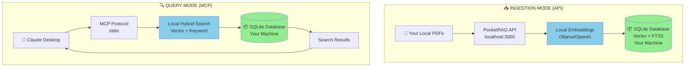

# 🧠 PocketRAG

<div align="center">

**100% Local RAG Server**

A self-hosted, privacy-first RAG server that runs entirely on your machine.

Index your PDFs, code, and docs into a portable SQLite database — then query via **REST API** or **MCP**.

[Quick Start](#-quick-start-5-minutes) • [Why Local RAG?](#-why-local-rag) • [Usage Modes](#-usage-modes) • [Troubleshooting](#-troubleshooting)

</div>

> 🔒 **Privacy First:** Everything stays local. Your documents, embeddings, and searches never leave your machine when using Ollama. You own the data, you control the infrastructure.

**Two Ways to Use:**
1. 🌐 **REST API** — Use with any application, script, or AI assistant
2. 🔌 **MCP Server** — Seamless integration with Claude Desktop

---

## ⚡ Why Local RAG?

Unlike cloud-based RAG services, PocketRAG gives you complete control:

**🔒 100% Local & Private**

- All data stays on your machine
- No uploads to external servers (when using Ollama)
- Your documents never leave your infrastructure
- Full control over embeddings and storage

**📚 Document-Centric Knowledge Base**

- Index entire PDF libraries, codebases, and documentation
- Persistent across all conversations
- Advanced hybrid search (semantic + keyword)
- No token limits on indexed content

**🔧 Self-Hosted & Customizable**

- Run your own embedding models (Ollama/OpenAI)
- Portable SQLite database you can backup/share
- REST API for automation and scripting
- Open source — modify and extend as needed

**When to use PocketRAG:**

- You need **privacy** and want documents to stay local
- You're indexing **large document collections** (100+ PDFs, codebases)
- You want **full control** over your knowledge base
- You need **offline access** to your RAG system
- You want to **programmatically query** via REST API

### Visual Comparison

```

┌─────────────────────────────────────────────────────────────────┐
│ PocketRAG (Local RAG) ✅ │
├─────────────────────────────────────────────────────────────────┤
│ │
│ Your Computer ONLY │
│ ┌──────────────┐ MCP ┌──────────────┐ │
│ │ Claude Desktop│◀──────────────▶│ PocketRAG │ │
│ └──────────────┘ (stdio) │ ├─ Ollama │ │
│ │ ├─ SQLite │ │
│ │ └─ Search │ │
│ └──────────────┘ │
│ 🔒 Everything stays local - You own the data │
│ │
└─────────────────────────────────────────────────────────────────┘
```

---

## 🏗️ Architecture

**100% Local Processing:** All embeddings, searches, and storage happen on your machine. Your documents never touch external servers when using Ollama.

PocketRAG uses **Reciprocal Rank Fusion (RRF)** to combine semantic understanding with exact keyword matching for superior retrieval.



**Privacy Guarantee:** With Ollama, everything stays local — embeddings, database, searches. Claude only receives the search results you explicitly query.

---

## 📋 Prerequisites

- [Docker Desktop](https://www.docker.com/products/docker-desktop/)
- [Ollama](https://ollama.ai/download) (**Recommended** for 100% local operation)

**One-time Setup:** Pull the embedding and chat models:

```bash
# High-quality embedding model (1024 dims)
ollama pull mxbai-embed-large

# Chat model (choose one)
ollama pull llama3.2 # Default, lightweight (2GB)
ollama pull qwen2.5-coder:7b # Best for code-heavy docs
ollama pull llama3.2:3b # Balanced quality/speed
```

> 💡 **Alternative:** Use the lighter `nomic-embed-text` model (~200MB) if you prefer faster downloads:
>
> ```bash
> ollama pull nomic-embed-text
> ```
>
> Set `OLLAMA_EMBED_MODEL=nomic-embed-text` in your environment.

> 💡 **Optional:** You can use OpenAI embeddings instead, but this sends document chunks to OpenAI's API. See [Advanced Configuration](#️-advanced-configuration) for details.

---

## 📖 Usage Modes

PocketRAG works in two modes:

### 1. 🌐 REST API Mode (Universal)
Use PocketRAG with **any** application or AI assistant:
- Custom applications and scripts
- OpenAI GPT with function calling
- LangChain, LlamaIndex integrations
- Any LLM with HTTP client
- Automation workflows

**Endpoints:**
- `POST /learn` - Upload PDFs
- `GET /ask?q=query&mode=hybrid` - Search and get answers
- `GET /stats` - Get database statistics

### 2. 🔌 MCP Mode (Claude Desktop)
Native integration with Claude Desktop via Model Context Protocol:
- Claude can search your docs automatically
- No manual API calls needed
- Seamless conversation flow

**Choose the mode that fits your use case!**

---

## 🚀 Quick Start (5 Minutes)

### 1. Build & Start

Start the server to index your documents:

````bash
# 1. Clone & Build
git clone https://github.com/naveenchand/pocket-rag.git
cd pocket-rag
docker-compose up --build -d

# 2. Start the server
docker-compose up -d

# Check it's running
curl http://localhost:3000
> 🐧 **Linux Users:** Update `docker-compose.yml` to use `OLLAMA_URL=http://localhost:11434` and add `network_mode: host`.

---

### 2. Feed Your Knowledge

Upload your legacy code, PDF contracts, or documentation.

```bash
# Upload a PDF
curl -X POST "http://localhost:3000/learn" -F "file=@./manual.pdf"

# Check stats (See how many chunks are indexed)
curl http://localhost:3000/stats

# Test a search query manually
curl "http://localhost:3000/ask?q=summary&mode=hybrid"
````

---

### 3. Connect to Claude (Memory Mode)

> ⚠️ **CRITICAL:** Stop the ingestion container. SQLite allows only one writer at a time.

```bash
docker stop pocket-rag-api && docker rm pocket-rag-api
```

**Add to Claude Config:**

| Platform    | Config Path                                                       |
| ----------- | ----------------------------------------------------------------- |
| **macOS**   | `~/Library/Application Support/Claude/claude_desktop_config.json` |
| **Windows** | `%APPDATA%\Claude\claude_desktop_config.json`                     |

**macOS Example:**

```json
{
  "mcpServers": {
    "pocket-rag": {
      "command": "docker",
      "args": [
        "run",
        "-i",
        "--rm",
        "-v",
        "/Users/YOUR_USERNAME/pocket-rag-data:/data",
        "-e",
        "DB_PATH=/data/pocket-rag.sqlite",
        "-e",
        "OLLAMA_URL=http://host.docker.internal:11434",
        "pocket-rag",
        "bun",
        "run",
        "src/mcp.ts"
      ]
    }
  }
}
```

**Windows Example:**

```json
{
  "mcpServers": {
    "pocket-rag": {
      "command": "docker",
      "args": [
        "run",
        "-i",
        "--rm",
        "-v",
        "C:/Users/YOUR_USERNAME/pocket-rag-data:/data",
        "-e",
        "DB_PATH=/data/pocket-rag.sqlite",
        "-e",
        "OLLAMA_URL=http://host.docker.internal:11434",
        "pocket-rag",
        "bun",
        "run",
        "src/mcp.ts"
      ]
    }
  }
}
```

**Linux Example:**

```json
{
  "mcpServers": {
    "pocket-rag": {
      "command": "docker",
      "args": [
        "run",
        "-i",
        "--rm",
        "--network",
        "host",
        "-v",
        "/home/YOUR_USERNAME/pocket-rag-data:/data",
        "-e",
        "DB_PATH=/data/pocket-rag.sqlite",
        "-e",
        "OLLAMA_URL=http://localhost:11434",
        "pocket-rag",
        "bun",
        "run",
        "src/mcp.ts"
      ]
    }
  }
}
```

> 💡 Replace `/Users/YOUR_USERNAME/...` with your actual absolute path. Run `whoami` to find your username.

---

### 4. Use It

**Restart Claude Desktop.** Look for the 🔌 icon.

Try asking:

> _"Search the knowledge base for 'Project Titan' and list the key deliverables."_

---

## ⚙️ Advanced Configuration

### Privacy vs. Quality Trade-offs

**Default (Recommended): 100% Local with Ollama**

- ✅ All processing happens on your machine
- ✅ Documents never leave your infrastructure
- ✅ No API costs
- ✅ Works offline
- ⚠️ Slightly lower embedding quality than OpenAI

**Optional: OpenAI for Better Embeddings**

- ✅ Higher quality vector embeddings
- ✅ Better semantic search accuracy
- ⚠️ **Sends document chunks to OpenAI API**

### Environment Variables

| Variable         | Default                             | Description                              |
| ---------------- | ----------------------------------- | ---------------------------------------- |
| `DB_PATH`        | `/data/pocket-rag.sqlite`           | Internal DB path                         |
| `EMBED_PROVIDER` | `ollama`                            | Options: `ollama`, `openai`              |
| `CHAT_PROVIDER`  | `ollama`                            | Options: `ollama`, `openai`, `anthropic` |
| `OLLAMA_URL`     | `http://host.docker.internal:11434` | URL for Ollama                           |
| `OPENAI_API_KEY` | -                                   | Required if provider is `openai`         |

**Example: Running with OpenAI**

```bash
docker run -d \
--name pocket-rag-api \
-p 3000:3000 \
-v ~/pocket-rag-data:/data \
-e DB_PATH=/data/pocket-rag.sqlite \
-e EMBED_PROVIDER=openai \
-e CHAT_PROVIDER=openai \
-e OPENAI_API_KEY=sk-proj-... \
pocket-rag
```

---

## 🛠️ MCP Tools

PocketRAG exposes these tools to Claude:

| Tool                       | Description                                       |
| -------------------------- | ------------------------------------------------- |
| `search_knowledge_base`    | Hybrid search (vector + FTS) across all documents |
| `get_knowledge_base_stats` | Get document and chunk counts                     |
| `list_documents`           | List all uploaded documents                       |

---

## ❓ Troubleshooting

### "Database is locked"

**Cause:** You left the API container running while trying to use Claude.

**Fix:** Run `docker stop pocket-rag-api`.

---

### "Connection Refused" (Linux)

**Cause:** Docker on Linux cannot reach `host.docker.internal`.

**Fix:** Use `--network host` and `localhost` in your URL.

---

### "File not found" (Claude)

**Cause:** The volume path in your JSON config is wrong.

**Fix:** Use the absolute path (e.g., `/Users/alex/pocket-rag-data`) not `~`.

---

## ⚡ Performance

**Lightweight & Fast** — Built with Bun for maximum performance.

| Metric            | Measured Value | Notes                           |
| ----------------- | -------------- | ------------------------------- |
| **Docker Image**  | 342 MB         | Code + Bun runtime + sqlite-vec |
| **RAM Usage**     | ~55 MB         | Idle, after cold start          |
| **Cold Start**    | < 500ms        | Server ready to accept requests |
| **Hybrid Search** | ~100ms         | Vector + FTS5 combined          |

**Embedding Performance (Batch Processing):**
| Chunks | Old (1-at-a-time) | New (Batch) | Speedup |
|--------|-------------------|-------------|---------|
| 1,000 | ~500s | ~30s | **16x** |
| 10,000 | ~5,000s | ~300s | **16x** |

> 💡 Uses Ollama's `/api/embed` endpoint with batch size of 32 and 4 concurrent requests.

**LLM Response (with `keep_alive: -1`):**
| Call | Time | Notes |
|------|------|-------|
| First (cold) | ~10-15s | Model loading into RAM |
| Subsequent (warm) | ~2-5s | Model already loaded |

---

## 🤝 Contributing

PocketRAG is open source! Contributions welcome:

- 🐛 Bug reports and fixes
- ✨ Feature requests and implementations
- 📖 Documentation improvements
- 🧪 Test coverage

---

## 📄 License

MIT License — Free for personal and commercial use.
